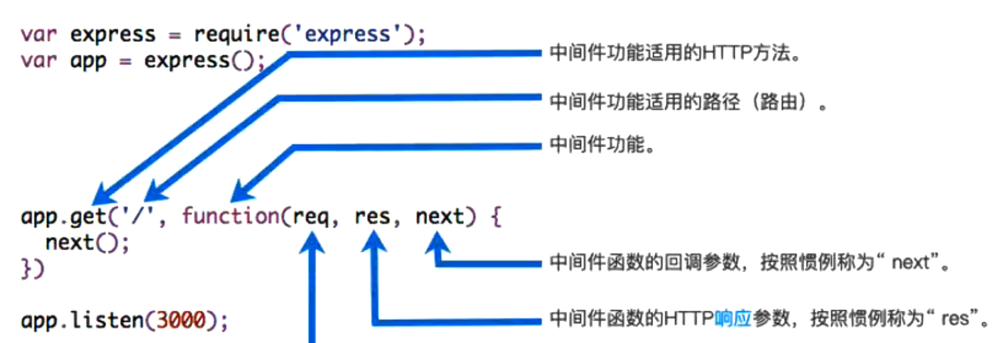

Express应用程序本质上是一系列中间件函数的调用

中间件是什么呢？
- 中间件的本质就是一个回调函数；
- 这个回调函数接受三个参数：
1. 请求对象(request对象）；
2. 响应对象（response对象）；
3. next函数（在express中定义的用于执行下一个中间件的函数）；

中间件中可以执行哪些任务呢？
1. 执行任何代码；
2. 更改请求(request）和响应(response）对象；
3. 结束请求-响应周期（返回数据） ；
4. 调用栈中的下一个中间件；

如果当前中问件功能没有结束请求-响应周期，则必须调用next()将控制权传递给下一个中间件功能，否则，请求将被挂起。

## express主要提供了两种方式:

express主要提供了两种方式：app/router.use和app/router.methods

### app.use

use的用法，因为methods的方式本质是use的特殊情况；

#### 案例一：最普通的中间件

#### 案例二：path匹配中间件

#### 案例三：path和method匹配中间件

#### 案例四：注册多个中间件

## 

